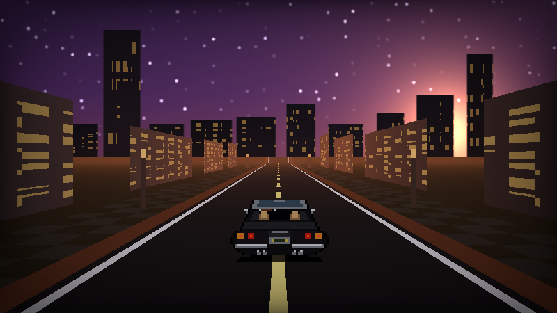
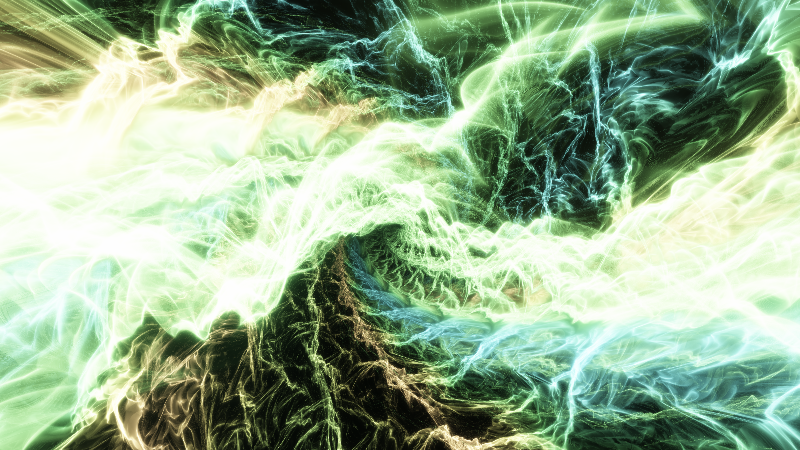
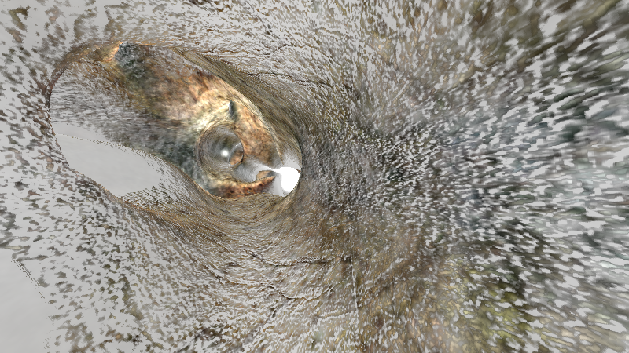
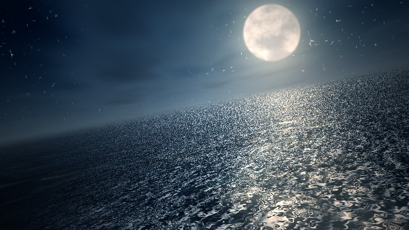
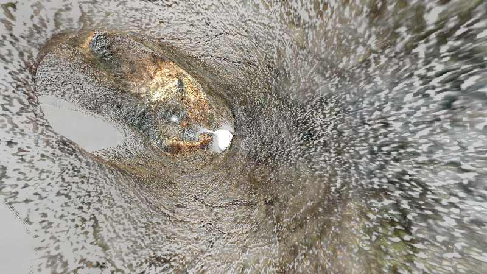
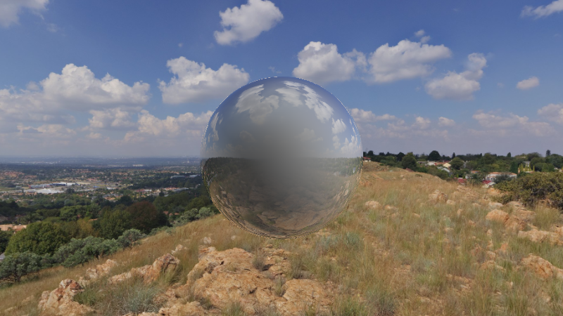

Shader Workshop Shaders
=======================

While [Shader Workshop](https://shaderworkshop.com/) comes with a few example shaders
I am constantly creating and porting new shaders to test various features, see
how different things perform, or just for fun. I try to post some of these
to [X](https://x.com/robertswinkler), sometimes just the shader, sometimes a
screen recording with commentary.

The collection is getting too big to keep in the main repo and they really
should be public and easy to access anyway.

I'll try to keep these somewhat organized.

Gallery
=======

### Original Shaders

These are misc. shaders I came up either for fun or to demonstrate some specific feature
or functionality.

|  shader   | image  | last version updated | original developer |
|-----------|--------|:-----------------------:|:----------------------|
| [fake_3d_cityscape](original/fake_3d_cityscape.cpp) |  | 0.8.0 | [Robert Winkler](https://github.com/rswinkle) |

### Ports

These are ports of others' shaders, often with tweaks, or a custom GUI added to adjust parameters live to see the effect on visuals and performance.

|  shader   | image  | last version updated | original developer |
|-----------|--------|:-----------------------:|:---------------------:|
| [geometric_play](ports/geometric_play.cpp) |  | 0.8.0 | [Yohei Nishitsuji](https://fragcoord.xyz/s/gof15tt0) |
| [music_pirates](ports/music_pirates.cpp) |  | 0.8.0 | [Inigo Quilez](https://www.shadertoy.com/view/4ts3z2) |
| [music_pirates_mipmapped](ports/music_pirates_mipmapped.cpp) |  | 0.8.0 | [Inigo Quilez](https://fragcoord.xyz/s/gof15tt0) |
| [the_cave](ports/the_cave.cpp) |  | 0.8.0 | [BoyC](https://www.shadertoy.com/view/MsX3RH) |
| [the_cave_mipmapped](ports/the_cave_mipmapped.cpp) |  | 0.8.0 | [BoyC](https://www.shadertoy.com/view/MsX3RH) |
| [3d_engine](ports/3d_engine.cpp) |  | 0.8.0 | [@Xor](https://fragcoord.xyz/s/3sg6dgao) |
